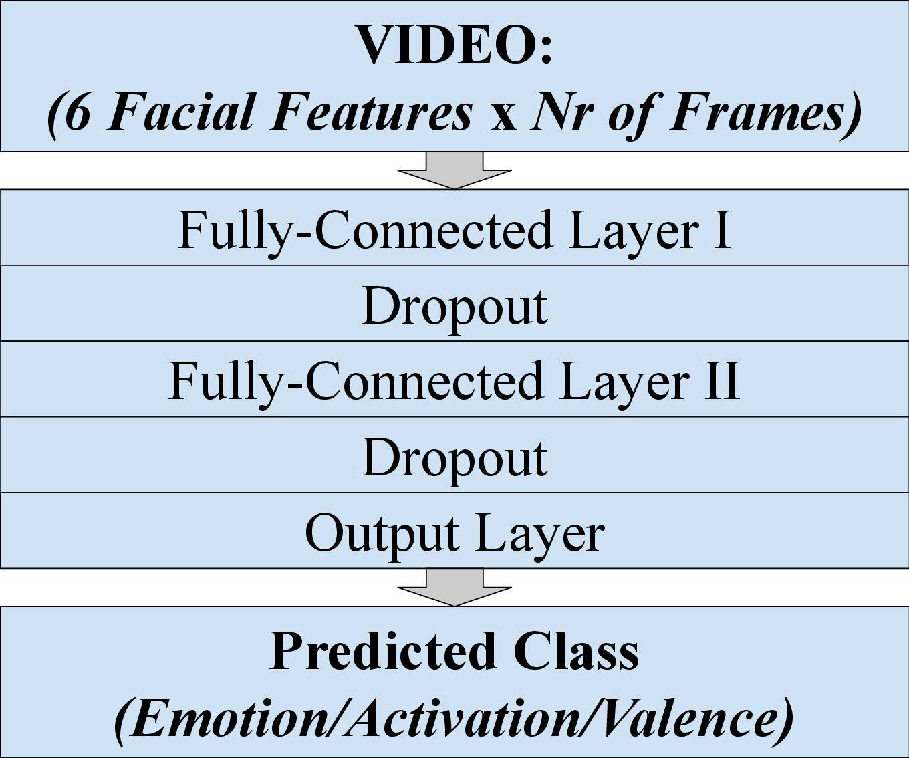
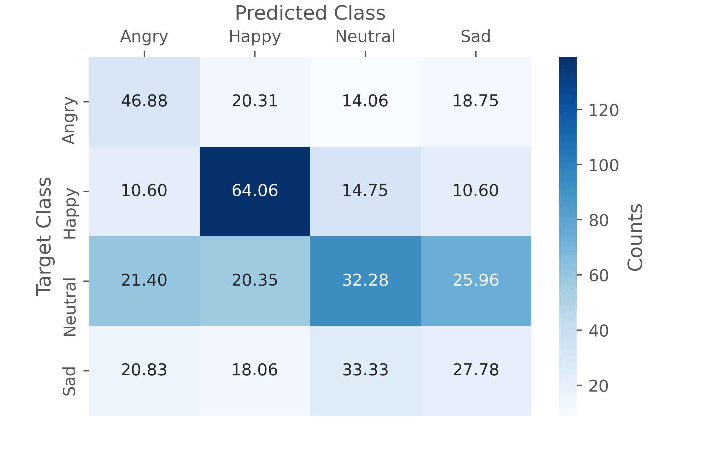
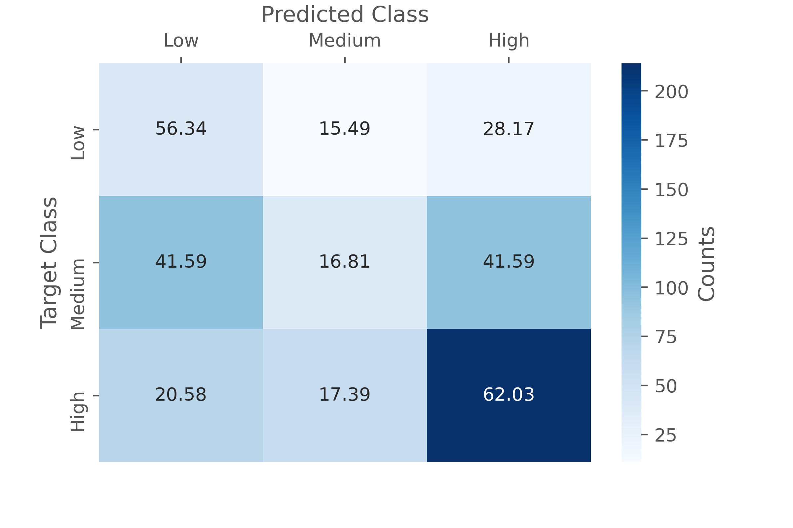
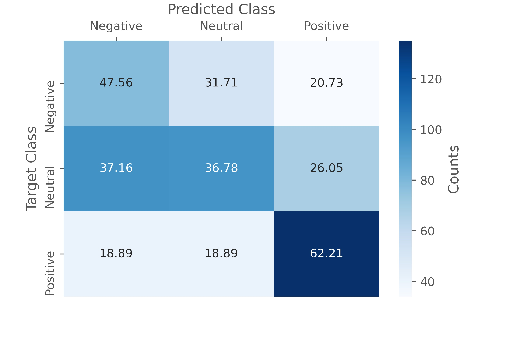

# emotion_recognition_from_facial_landmarks

## Summary
The goal of this project was to train and evaluate a model that would be able to automatically recognize one of **4 emotion classes** _(Angry, Happy, Neutral, Sad)_ in a video signal by inspecting the face of a speaker. This was achieved by using face detections from a pre-trained face detector.
In addition to the **emotion class model** auxiliary models for **activation** and **valence** were trained.

## Data
The data consisted of utterances from 12 speakers (6 female / 6 male) collected in 6 dyadic sessions. The vast majority of the data is assumed to be natural and not acted.

Emotion Class | Count | Percentage
------------ | ------------- | -------------
_Total_ | _7,756_ | _100.00%_
Angry | 791 | 10.20%
Happy | 2,622 | 33.81%
Neutral | 3,458 | 44.59%
Sad | 885 | 11.41%

## Feature Extraction
* Pixelvalues of raw face detections as features
* Using the OpenCV library to read out the individual video frames
* Converting to greyscale and downscaling the image as far as possible to
still be able to run face detections (goal: reducing processing time)
* Applying HOG frontal face detector from the Dlib toolkit
* Accumulating a targeted number of frames over a recording with an
adaptive sampling interval
* Filtering out recordings for which the targeted number of frames could
not be accumulated
* Combining features and labels into a pandas dataframe

## Preprocessing/Training/Evaluation
* Normalizing via Z-Score (mean=0; std=1)
* Using a CNN architecture wahere the selected frames from one recording are passed in as channels
* Performing training/evaluation in a 6-fold cross validation approach

## Model Architecture
Simplified visualization of the model architecture.

  

## Evaluation Results
Averaged results of the 6 individual evaluations.

|Emotion Class|
|:-------------------------:|
||

Activation             |  Valence
:-------------------------:|:-------------------------:
  |  
